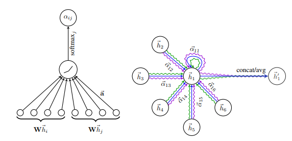

### Tensorflow-GAT-Tutorial

***

本教程将详细讲解如何用Tensorflow构建Graph Attention Networks（GAT)模型在Cora数据集上进行节点分类任务。完整代码可以在Github中进行下载：https://github.com/CrawlScript/tf_geometric/blob/master/demo/demo_gat.py

### GAT简介

***

GCN通过图的拉普拉斯矩阵来聚合邻居节点的特征信息，这种方式和图本身的结构紧密相关，这限制了GCN在训练时未见的图结构上的泛化能力。GAT利用注意力机制来对邻居节点特征加权求和，从而聚合邻域信息，GAT完全摆脱了图结构的束缚，是一种归纳式学习方式。

