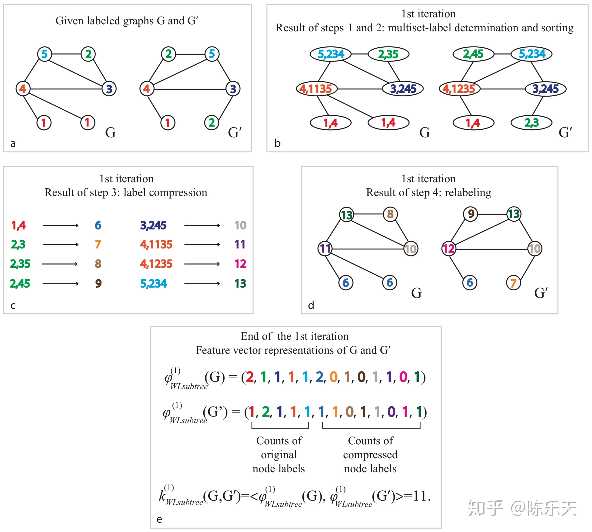

### Tensorflow-GIN-Tutorial

***

How Powerful are Graph Neural Networks?相信有很多人会和我一样在边吃泡面边跑模型的时候会产生这样的疑惑。本教程将手把手教大家搭建基于Tensorflow的GIN模型，同时把该论文（ICLR 2019 best student paper)中关于GNNs为什么有效果的观点简要介绍。

### GIN简介

***

* **GIN的起源**
  如GCN和GraphSAGE，都是通过迭代聚合一阶邻居信息来更新节点的特征表示，可以拆分为三个步骤：
  
  1. Aggregate:聚合一阶邻居节点的特征。
  
  2. Combine:将邻域特征与中心节点的特征融合，更新中心节点的特征。
  
  3. 如果是图分类任务，需要把Graph中所有节点特征转换为Graph的特征表示。
  
  上述方法都是基于经验主义，缺乏从理论的角度来分析GNN。GIN则是借助[Weisfeiler-Lehman(WL) test](http://www.jmlr.org/papers/volume12/shervashidze11a/shervashidze11a.pdf) 来分析GNN到底做了什么而变得如何powerful，在何种条件下GNN可以在图分类任务上和WL test一样强大。
  
* **WL test**

  WL_test是判断两个Graph结构是否相同的有效方法，主要通过迭代以下步骤来判断Graph的同构性：

 	（初始化：将节点的id作为自身的标签。）

​		1. 聚合：将邻居节点和自身的标签进行聚合。

​		2. 更新节点标签：使用Hash表将节点聚合标签映射作为节点的的新标签。

WL_test迭代过程如下图所示：

   

   		(此图引用自知乎陈乐天的文章《Graph Neural Networks多强大？》阅读笔记 - 陈乐天的文章 - 知乎 https://zhuanlan.zhihu.com/p/62006729，如有侵权，请联系删除)

​		上图a中的G图中节点1的邻居有节点4；节点2的邻居有节点3和节点5；节点3的邻居有节点2，节点4，节点5；节点4的邻居有节点1，节点3，节点5；节点5的邻居有节点2，节点3，节点4。

​	（步骤1）聚合邻居节点和自身标签后的结果就是b图中的G。然后用Hash将聚合后的结果映射为一个新的标签，进行标签压缩，如图c。用压缩后的标签来替代之前的聚合结果，进行标签更新，如图d，G‘同理。

​		对于Graph的特征表示，WL_test方法用迭代前后图中节点标签的个数作为Graph的表示特征，如图e所示。

从上图我们可以看出WL_test的迭代过程和GNN的聚合过程非常相似，并且作者也证明了WL_test是图神经网络聚合邻域信息能力的上限。


* **GIN节点更新**
	作者提出如果GNN中的Aggregate,Combine和Readout函数是[单射](https://zh.wikipedia.org/wiki/%E5%8D%95%E5%B0%84%E3%80%81%E5%8F%8C%E5%B0%84%E4%B8%8E%E6%BB%A1%E5%B0%84)(即映射关系为一对一)，则GNN可以达到上限，和WL_test一样。

	作者证明了当节点特征X可数时，将节点特征的聚合方式设置为sum，邻域特征与中心节点特征的融合系数设置为1+，会存在一个函数使得聚合函数为单射函数，即：

	同时作者进一步证明对于任意的聚合函数在满足单射性的条件下可以分解为

	然后用借助多层感知机（MLP）强大的拟合能力来学习上面公式中的和f，最后得到基于MLP+SUM 的GIN模型：

	对于每轮迭代产生的节点特征求和，然后拼接作为Graph的特征表示：


完整代码下载地址：https://github.com/wangyouze/tf_geometric/blob/sage/demo/demo_gin.py

论文下载地址：https://arxiv.org/pdf/1810.00826.pdf

文献参考：https://zhuanlan.zhihu.com/p/66589334

### 教程目录

***

* 开发环境
* GIN的实现
* 模型构建
* GIN训练
* GIN评估

### 开发环境

***

* 操作系统: Windows / Linux / Mac OS
* Python 版本: >= 3.5
* 依赖包:
* tf_geometric（一个基于Tensorflow的GNN库）
	根据你的环境（是否已安装TensorFlow、是否需要GPU）从下面选择一条安装命令即可一键安装所有Python依赖:
```
pip install -U tf_geometric # 这会使用你自带的TensorFlow，注意你需要tensorflow/tensorflow-gpu >= 1.14.0 or >= 2.0.0b1

	pip install -U tf_geometric[tf1-cpu] # 这会自动安装TensorFlow 1.x CPU版

	pip install -U tf_geometric[tf1-gpu] # 这会自动安装TensorFlow 1.x GPU版

	pip install -U tf_geometric[tf2-cpu] # 这会自动安装TensorFlow 2.x CPU版

	pip install -U tf_geometric[tf2-gpu] # 这会自动安装TensorFlow 2.x GPU版
```

教程使用的核心库是tf_geometric，一个基于TensorFlow的GNN库。tf_geometric的详细教程可以在其Github主页上查询：

- https://github.com/CrawlScript/tf_geometric

### GIN的实现

***


GIN的实现很简单。首先我们聚合中心节点的一阶邻域信息。tf_geometric提供了便捷的邻域信息聚合机制API。

```python
	h = aggregate_neighbors(
        x, edge_index, edge_weight,
        identity_mapper,
        sum_reducer,
        identity_updater
    )
```

然后计算，更新中心节点的特征表示。 可以设置为学习参数也可以设置为固定值。

```python

 h = x * (1 + eps) + h
```

MLP拟合特征变换函数和

```python
 h = mlp(h)

 if activation is not None:
    h = activation(h)

  return h
```

### 模型构建

***

* 导入相关库

  本教程使用的核心库是[tf_geometric](https://github.com/CrawlScript/tf_geometric)，我们用它来进行图数据导入、图数据预处理及图神经网络构建。GIN的具体实现已经在上面详细介绍，另外我们后面会使用keras.metrics.Accuracy评估模型性能。

  ```python
  # coding=utf-8
  import os
  import tensorflow as tf
  import numpy as np
  from tensorflow import keras
  from sklearn.model_selection import train_test_split
  os.environ["CUDA_VISIBLE_DEVICES"] = "0"
  ```

* 我们选用论文中的生物数据集NCI1训练和评估模型性能。第一次加载NCI1数据集，预计需要花费几分钟时间。数据集第一次被预处理之后，tf_geometric会自动保存预处理的结果，以便下一次调用。对于一个TU dataset会包含节点标签，节点属性等，每个graph的处理结果会被以字典形式保存，多个图的预处理结果以list的形式返回。

  ```python
  graph_dicts = tfg.datasets.TUDataset("COLLAB").load_data()
  ```
  
* 用数据构建Graph Object，即图模型输入的三要素：节点特征，边连接信息以及标签。GIN的目标是当模型不依赖输入的节点特征时，如何学习学习网络的拓扑结构。因此对于生物数据集NCI1，我们把节点的类别标签用one_hot表示后作为输入特征。

  ```python
  def construct_graph(graph_dict):
      return tfg.Graph(
          x=convert_node_labels_to_one_hot(graph_dict["node_labels"]),
          edge_index=graph_dict["edge_index"],
          y=graph_dict["graph_label"]  # graph_dict["graph_label"] is a list with one int element
      )
  
  graphs = [construct_graph(graph_dict) for graph_dict in graph_dicts]
  ```

  

* 定义模型。根据论文描述，我们的模型有五层GIN作为隐藏层，每个隐藏层后用[Batch_normalization](https://www.jianshu.com/p/a6e400a3887a)对数据进行归一化(抑制梯度消失和梯度爆炸)。

  ```python
  def call(self, inputs, training=False, mask=None):
          if len(inputs) == 4:
              x, edge_index, edge_weight, node_graph_index = inputs
          else:
              x, edge_index, _, node_graph_index = inputs
              edge_weight = None
  
          h1 = self.gin0([x, edge_index, edge_weight])
          h2 = self.bn1(h1)
          h2 = self.gin1([h2, edge_index, edge_weight])
          h3 = self.bn1(h2)
          h3 = self.gin2([h3, edge_index, edge_weight])
          h4 = self.bn2(h3)
          h4 = self.gin3([h4, edge_index, edge_weight])
          h5 = self.bn3(h4)
          h5 = self.gin4([h5, edge_index, edge_weight])
          h5 = self.bn3(h5)
  ```
  对每一隐藏层的输出进行sum pooling,将5层的pooling结果进行拼接。

  

  ```python
   h1 = tfg.nn.sum_pool(h1, node_graph_index)
          h2 = tfg.nn.sum_pool(h2, node_graph_index)
          h3 = tfg.nn.sum_pool(h3, node_graph_index)
          h4 = tfg.nn.sum_pool(h4, node_graph_index)
          h5 = tfg.nn.sum_pool(h5, node_graph_index)
  
          h = tf.concat((h1, h2, h3, h4, h5), axis=-1)
          out = self.mlp(h, training=training)
  
          return out
  ```

  

### GIN训练

***
* 数据集划分

  ```python
train_graphs, test_graphs = train_test_split(graphs, test_size=0.1)
  ```
  
* 计算标签种类

  ```python
  num_classes = np.max([graph.y[0] for graph in graphs]) + 1
  ```
  
* 初始化模型

  ```python
  model = GIN(32)
  ```

* 模型的训练与其他基于Tensorflow框架的模型训练基本一致，主要步骤有定义优化器，计算误差与梯度，反向传播等。我们将训练集中的Graphs以batch的形式输入模型进行训练，对于Graphs的划分可以调用我们tf_geometric中的函数create_graph_generator。
  
  ```python
  optimizer = tf.keras.optimizers.Adam(learning_rate=0.01)
  train_batch_generator = create_graph_generator(train_graphs, batch_size, shuffle=True, infinite=True)
  
  best_test_acc = 0
  for step in range(0, 1000):
      batch_graph = next(train_batch_generator)
      with tf.GradientTape() as tape:
          inputs = [batch_graph.x, batch_graph.edge_index, batch_graph.edge_weight,
                    batch_graph.node_graph_index]
          logits = model(inputs, training=True)
          losses = tf.nn.softmax_cross_entropy_with_logits(
              logits=logits,
              labels=tf.one_hot(batch_graph.y, depth=num_classes)
          )
  
          loss = tf.reduce_mean(losses)
      vars = tape.watched_variables()
      grads = tape.gradient(loss, vars)
      optimizer.apply_gradients(zip(grads, vars))
  
      if step % 10 == 0:
          train_acc = evaluate(train_graphs, batch_size)
          test_acc = evaluate(test_graphs, batch_size)
  
          if best_test_acc < test_acc:
              best_test_acc = test_acc
  
          print("step = {}\tloss = {}\ttrain_acc = {}\ttest_acc={}".format(step, loss, train_acc, best_test_acc))
  ```
  

### GIN评估

***

在评估模型性能的时候我们将测试集中的graph以batch的形式输入到我们的模型之中，用keras自带的keras.metrics.Accuracy计算准确率。

```
def evaluate():
    accuracy_m = keras.metrics.Accuracy()

    for test_batch_graph in create_graph_generator(test_graphs, batch_size, shuffle=False, infinite=False):
        logits = forward(test_batch_graph)
        preds = tf.argmax(logits, axis=-1)
        accuracy_m.update_state(test_batch_graph.y, preds)

    return accuracy_m.result().numpy()
```

### 运行结果

***

```python
step = 0	loss = 12.347851753234863	train_acc = 0.49905380606651306	test_acc=0.5036496520042419
step = 10	loss = 0.8783968091011047	train_acc = 0.5509597063064575	test_acc=0.525547444820404
step = 20	loss = 0.6645355820655823	train_acc = 0.5404163002967834	test_acc=0.525547444820404
step = 30	loss = 0.6511620283126831	train_acc = 0.5904298424720764	test_acc=0.5790753960609436
...
step = 820	loss = 0.36381691694259644	train_acc = 0.8553662896156311	test_acc=0.8175182342529297
step = 830	loss = 0.33948060870170593	train_acc = 0.8645579814910889	test_acc=0.8248175382614136
step = 840	loss = 0.3843861520290375	train_acc = 0.8599621653556824	test_acc=0.8248175382614136
step = 850	loss = 0.3698282241821289	train_acc = 0.850229799747467	test_acc=0.8248175382614136
```

### 完整代码链接

demo_gin.py: https://github.com/wangyouze/tf_geometric/blob/sage/demo/demo_gin.py