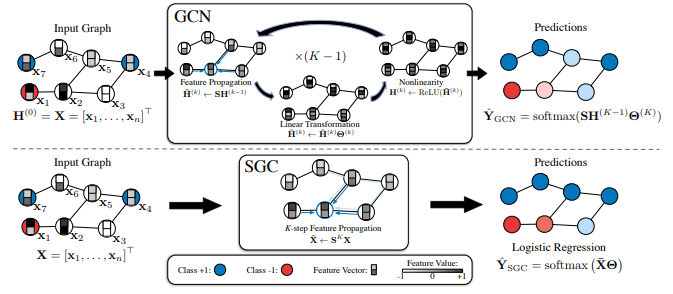

### Tensorflow-SGC-Tutorial

***

GCN作为一种经典的图神经网络模型，已经成为了诸多新手入门图神经网络的必学模型，而近些年对于GCN的各种魔改也层出不穷。本着爱屋及乌的目的，本教程将教你如何用Tensorflow构建GCN的变体SGC模型进行节点分类任务。完整的代码可在Github中下载：https://github.com/wangyouze/tf_geometric/blob/sage/demo/demo_sgc.py

### SGC简介

***

SGC是GCN的变体之一，全称[Simplifying Graph Convolutional Networks](https://arxiv.org/pdf/1902.07153.pdf)，论文发表在ICML2019上。相比于GCN，SGC通过消除GCN层之间的非线性，将非线性的GCN转变为一个简单的线性模型，减小了模型复杂度，在很多任务上比GCN以及其他GNN模型更加高效。
<div align=center>
	
</div>


* GCN做节点分类任务时：

1. 对邻接矩阵进行归一化并且添加自环：
2. 对输入的节点特征进行平滑处理：
3. 对节点特征进行非线性转换：

所以对于节点分类任务，一个K层的GCN可以表示为：

* SGC移除了GCN每层之间的激活函数，将原先的非线性变换简化为线性变换，因此SGC在做节点分类任务时：

1. 对邻接矩阵进行归一化并且添加自环：

2. 对输入的节点特征进行平滑处理：
3. 对节点特征进行线性转换：

所以对于节点分类任务，一个K层的SGC可以表示为，简写为


SGC中的可以提前计算，大大减少了计算量。

通过以上的对比，我们可以清晰的认识到二者之间的异同点，下面我们将基于tf_geometric实现SGC模型（SGC以集成到GNN库tf_geometric中）。

教程中完整的代码链接：

* demo_sgc.py:https://github.com/wangyouze/tf_geometric/blob/sage/demo/demo_sgc.py
* 论文地址：https://arxiv.org/pdf/1902.07153.pdf

### 教程目录
***

* 开发环境
* SGC 的实现
* 模型构建
* SGC训练
* SGC评估

### 开发环境

***

* 操作系统: Windows / Linux / Mac OS
* Python 版本: >= 3.5
* 依赖包:
  - tf_geometric（一个基于Tensorflow的GNN库）

根据你的环境（是否已安装TensorFlow、是否需要GPU）从下面选择一条安装命令即可一键安装所有Python依赖:


```python
	pip install -U tf_geometric # 这会使用你自带的TensorFlow，注意你需要tensorflow/tensorflow-gpu >= 1.14.0 or >= 2.0.0b1

	pip install -U tf_geometric[tf1-cpu] # 这会自动安装TensorFlow 1.x CPU版

	pip install -U tf_geometric[tf1-gpu] # 这会自动安装TensorFlow 1.x GPU版

	pip install -U tf_geometric[tf2-cpu] # 这会自动安装TensorFlow 2.x CPU版

	pip install -U tf_geometric[tf2-gpu] # 这会自动安装TensorFlow 2.x GPU版
	

```

教程使用的核心库是tf_geometric，一个基于TensorFlow的GNN库。tf_geometric的详细教程可以在其Github主页上查询：

* https://github.com/CrawlScript/tf_geometric

### SGC 的具体实现

***
对图的邻接矩阵进行对称归一化处理：
```python
     updated_edge_index, normed_edge_weight = gcn_norm_edge(edge_index, x.shape[0], edge_weight,renorm, improved, cache)
```

计算，扩大模型的感受野，aggregator_neighbor聚合一阶邻居节点信息。

```python
 h = x
    for _ in range(K):
        h = aggregate_neighbors(
            h,
            updated_edge_index,
            normed_edge_weight,
            gcn_mapper,
            sum_reducer,
            identity_updater
        )
```

对上面的结果进行线性变换，返回计算结果：

```python
h = h @ kernel

    if bias is not None:
        h += bias
    return h
```

以上我们实现了SGC中的部分，现在我们只需要在模型的最后一层的输出上添加softmax激活函数（为了获得概率输出）就可以进行节点分类了。

### 模型构建

***

* 导入相关库

  本教程使用的核心库是[tf_geometric](https://github.com/CrawlScript/tf_geometric)，我们用它来进行图数据导入、图数据预处理及图神经网络构建。SGC的具体实现已经在上面详细介绍，另外我们后面会使用keras.metrics.Accuracy评估模型性能。

  ```python
  # coding=utf-8
  import os
  os.environ["CUDA_VISIBLE_DEVICES"] = "0"
  import tensorflow as tf
  from tensorflow import keras
  from tf_geometric.layers.conv.sgc import SGC
  from tf_geometric.datasets.cora import CoraDataset
  ```

  

* 使用[tf_geometric](https://github.com/CrawlScript/tf_geometric)自带的图结构数据接口加载Cora数据集：

  ```python
  graph, (train_index, valid_index, test_index) = CoraDataset().load_data()
  ```

* 定义模型

  ```python
  model = SGC(num_classes, k=2)
  ```

### SGC训练

模型的训练与其他基于Tensorflow框架的模型训练基本一致，主要步骤有定义优化器，计算误差与梯度，反向传播等。SGC模型K阶的计算结果由softmax映射到（0,1）直接进行多分类任务。

```python
optimizer = tf.keras.optimizers.Adam(learning_rate=0.2)
for step in range(1,101):
    with tf.GradientTape() as tape:
        logits = model([graph.x, graph.edge_index, graph.edge_weight], cache=graph.cache)
        logits = tf.nn.log_softmax(logits,axis=1)
        loss = compute_loss(logits, train_index, tape.watched_variables())

    vars = tape.watched_variables()
    grads = tape.gradient(loss, vars)
    optimizer.apply_gradients(zip(grads, vars))

    valid_acc = evaluate(valid_index)
    test_acc = evaluate(test_index)

    print("step = {}\tloss = {}\tvalid_acc = {}\ttest_acc = {}".format(step, loss, valid_acc, test_acc))
```

* 用交叉熵损失函数计算模型损失。注意在加载Cora数据集的时候，返回值是整个图数据以及相应的train_mask,valid_mask,test_mask。SGC在训练的时候的输入时整个Graph，在计算损失的时候通过train_mask来计算模型在训练集上的迭代损失。因此，此时传入的mask_index是train_index。由于是多分类任务，需要将节点的标签转换为one-hot向量以便于模型输出的结果维度对应。由于图神经模型在小数据集上很容易就会疯狂拟合数据，所以这里用L2正则化缓解过拟合。

  ```python
  def compute_loss(logits, mask_index, vars):
      masked_logits = tf.gather(logits, mask_index)
      masked_labels = tf.gather(graph.y, mask_index)
  
      losses = tf.nn.softmax_cross_entropy_with_logits(
          logits=masked_logits,
          labels=tf.one_hot(masked_labels, depth=num_classes)
      )
  
      kernel_vals = [var for var in vars if "kernel" in var.name]
      l2_losses = [tf.nn.l2_loss(kernel_var) for kernel_var in kernel_vals]
  
      return tf.reduce_mean(losses) + tf.add_n(l2_losses) * 5e-5
  ```

### SGC评估

***
在评估模型性能的时候我们只需传入valid_mask或者test_mask，通过tf.gather函数就可以拿出验证集或测试集在模型上的预测结果与真实标签，用keras自带的keras.metrics.Accuracy计算准确率。
```python
def evaluate(mask):
    logits = forward(graph)
    logits = tf.nn.log_softmax(logits, axis=1)
    masked_logits = tf.gather(logits, mask)
    masked_labels = tf.gather(graph.y, mask)

    y_pred = tf.argmax(masked_logits, axis=-1, output_type=tf.int32)
    accuracy_m = keras.metrics.Accuracy()
    accuracy_m.update_state(masked_labels, y_pred)
    return accuracy_m.result().numpy()
```

### 运行结果

```
step = 1	loss = 1.9458770751953125	valid_acc = 0.5120000243186951	test_acc = 0.5389999747276306
step = 2	loss = 1.8324840068817139	valid_acc = 0.722000002861023	test_acc = 0.7350000143051147
step = 3	loss = 1.7052000761032104	valid_acc = 0.4740000069141388	test_acc = 0.4729999899864197
step = 4	loss = 1.6184687614440918	valid_acc = 0.5580000281333923	test_acc = 0.5360000133514404
...
step = 97	loss = 0.9681359529495239	valid_acc = 0.7919999957084656	test_acc = 0.8130000233650208
step = 98	loss = 0.9678354263305664	valid_acc = 0.7919999957084656	test_acc = 0.8100000023841858
step = 99	loss = 0.9675441384315491	valid_acc = 0.7919999957084656	test_acc = 0.8100000023841858
step = 100	loss = 0.967261791229248	valid_acc = 0.7919999957084656	test_acc = 0.8100000023841858
```

### 完整代码

教程中的完整代码链接：

* demo_sgc.py:https://github.com/wangyouze/tf_geometric/blob/sage/demo/demo_sgc.py