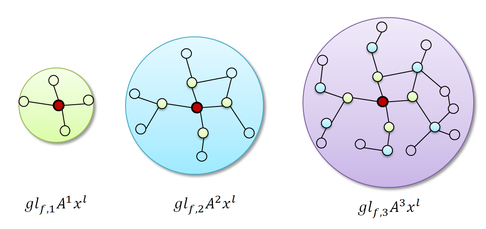

### Tensorflow-TAGCN-Tutorial

***

继上一节介绍了GCN的变体[SGC](https://github.com/wangyouze/GNN-algorithms/tree/master/SGC-%E7%AE%80%E5%8C%96GCN)，这一节我们继续介绍GCN的另外一个变体TAGCN。本教程将叫你如何用Tensorflow构建GCN的变体TAGCN模型进行节点分类任务。完整代码可在Github中下载：https://github.com/CrawlScript/tf_geometric/blob/master/demo/demo_tagcn.py

### TAGCN简介

***

TAGCN是GCN的变体之一，全称[TOPOLOGY ADAPTIVE GRAPH CONVOLUTIONAL NETWORKS](https://arxiv.org/pdf/1710.10370.pdf)（TAGCN)。相比于GCN对卷积核进行Chebyshev多项式近似后取k=1，TAGCN将k保留下来作为超参数。TAGCN在用多项式近似卷积核的时候，保留多项式的阶数k作为超参，将多项式卷积核视为尺寸是1到K的k个卷积核的集合，类似于GoogleNet中每一个卷积层都有大小不同的卷积核提取特征。

从TAGCN卷积公式上看：

1. 对邻接矩阵进行归一化处理：

2. 多项式卷积核，是多项式系数，相比于GCN，TAGCN保留了超参数K：

3. k个卷积核在图结构数据上提取特征，进行线性组合：
4. 仿照CNN结构，添加非线性操作：

下图展示了TAGCN在k=3时的卷积过程，类似CNN中的每一个卷积层中由多个卷积核提取feature map形成多个channel。

<div align=center>
	
</div>


* 教程完整代码链接：https://github.com/CrawlScript/tf_geometric/blob/master/demo/demo_tagcn.py
* 论文地址：https://arxiv.org/pdf/1710.10370.pdf

### 教程目录

***
* 开发环境
* TAGCN的实现
* 模型构建
* TAGCN训练
* TAGCN评估 

### 开发环境
***
* 操作系统: Windows / Linux / Mac OS
* Python 版本: >= 3.5
* 依赖包:
* tf_geometric（一个基于Tensorflow的GNN库）
	根据你的环境（是否已安装TensorFlow、是否需要GPU）从下面选择一条安装命令即可一键安装所有Python依赖:
```
pip install -U tf_geometric # 这会使用你自带的TensorFlow，注意你需要tensorflow/tensorflow-gpu >= 1.14.0 or >= 2.0.0b1

	pip install -U tf_geometric[tf1-cpu] # 这会自动安装TensorFlow 1.x CPU版

	pip install -U tf_geometric[tf1-gpu] # 这会自动安装TensorFlow 1.x GPU版

	pip install -U tf_geometric[tf2-cpu] # 这会自动安装TensorFlow 2.x CPU版

	pip install -U tf_geometric[tf2-gpu] # 这会自动安装TensorFlow 2.x GPU版
```

教程使用的核心库是tf_geometric，一个基于TensorFlow的GNN库。tf_geometric的详细教程可以在其Github主页上查询：

- https://github.com/CrawlScript/tf_geometric

### TAGCN的实现

***
首先我们对图的邻接矩阵添加自环，进行归一化处理。其中xs用来存储k个多项式卷积核提取的feature map：
```python
xs = [x]
    updated_edge_index, normed_edge_weight = gcn_norm_edge(edge_index, x.shape[0], edge_weight,
                                                           renorm, improved, cache)
```

分别计算k个多项式卷积核提取图节点的邻域信息，即计算k阶多项式，并以此将结果存储到xs中：

```python
for k in range(K):
        h = aggregate_neighbors(
            xs[-1], updated_edge_index, normed_edge_weight,
            gcn_mapper,
            sum_reducer,
            identity_updater
        )

        xs.append(h)
```

将K个多项式卷积核提取的feature_map拼接，然后线性变换输出结果：

```python
h = tf.concat(xs, axis=-1)

    out = h @ kernel
    if bias is not None:
        out += bias

    if activation is not None:
        out = activation(out)

    return out
```

### 模型构建

***

* 导入相关库

  本教程使用的核心库是[tf_geometric](https://github.com/CrawlScript/tf_geometric)，我们用它来进行图数据导入、图数据预处理及图神经网络构建。SGC的具体实现已经在上面详细介绍，另外我们后面会使用keras.metrics.Accuracy评估模型性能。

  ```python
  # coding=utf-8
  import os
  
  os.environ["CUDA_VISIBLE_DEVICES"] = "0"
  import tensorflow as tf
  import numpy as np
  from tensorflow import keras
  from tf_geometric.layers.conv.tagcn import TAGCN
  from tf_geometric.datasets.cora import CoraDataset
  ```

  

* 使用[tf_geometric](https://github.com/CrawlScript/tf_geometric)自带的图结构数据接口加载Cora数据集：

  ```python
  graph, (train_index, valid_index, test_index) = CoraDataset().load_data()
  ```

* 定义模型，引入keras.layers中的Dropout层随机关闭神经元缓解过拟合。由于Dropout层在训练和预测阶段的状态不同，为此，我们通过参数training来决定是否需要Dropout发挥作用。

  ```pytyhon
  tagcn0 = TAGCN(16)
  tagcn1 = TAGCN(num_classes)
  dropout = keras.layers.Dropout(0.3)
  
  def forward(graph, training=False):
      h = tagcn0([graph.x, graph.edge_index, graph.edge_weight], cache=graph.cache)
      h = dropout(h, training=training)
      h = tagcn1([h, graph.edge_index, graph.edge_weight], cache=graph.cache)
  
      return h
  ```

### TAGCN训练

***

模型的训练与其他基于Tensorflow框架的模型训练基本一致，主要步骤有定义优化器，计算误差与梯度，反向传播等。TAGCN论文用模型在第100轮训练后的表现来评估模型，因此这里我们设置epoches=100。

```python
optimizer = tf.keras.optimizers.Adam(learning_rate=0.01)

best_test_acc = tmp_valid_acc = 0
for step in range(1, 101):
    with tf.GradientTape() as tape:
        logits = forward(graph, training=True)
        loss = compute_loss(logits, train_index, tape.watched_variables())

    vars = tape.watched_variables()
    grads = tape.gradient(loss, vars)
    optimizer.apply_gradients(zip(grads, vars))

    valid_acc = evaluate(valid_index)
    test_acc = evaluate(test_index)
    if test_acc > best_test_acc:
        best_test_acc = test_acc
        tmp_valid_acc = valid_acc
    print("step = {}\tloss = {}\tvalid_acc = {}\tbest_test_acc = {}".format(step, loss, tmp_valid_acc, best_test_acc))
```

* 用交叉熵损失函数计算模型损失。注意在加载Cora数据集的时候，返回值是整个图数据以及相应的train_mask,valid_mask,test_mask。TAGCN在训练的时候的输入时整个Graph，在计算损失的时候通过train_mask来计算模型在训练集上的迭代损失。因此，此时传入的mask_index是train_index。由于是多分类任务，需要将节点的标签转换为one-hot向量以便于模型输出的结果维度对应。由于图神经模型在小数据集上很容易就会疯狂拟合数据，所以这里用L2正则化缓解过拟合。

  ```python
  def compute_loss(logits, mask_index, vars):
      masked_logits = tf.gather(logits, mask_index)
      masked_labels = tf.gather(graph.y, mask_index)
      losses = tf.nn.softmax_cross_entropy_with_logits(
          logits=masked_logits,
          labels=tf.one_hot(masked_labels, depth=num_classes)
      )
  
      kernel_vals = [var for var in vars if "kernel" in var.name]
      l2_losses = [tf.nn.l2_loss(kernel_var) for kernel_var in kernel_vals]
  
      return tf.reduce_mean(losses) + tf.add_n(l2_losses) * 5e-4
  ```

### TAGCN评估

***

在评估模型性能的时候我们只需传入valid_mask或者test_mask，通过tf.gather函数就可以拿出验证集或测试集在模型上的预测结果与真实标签，用keras自带的keras.metrics.Accuracy计算准确率。

```python
def evaluate(mask):
    logits = forward(graph)
    logits = tf.nn.log_softmax(logits, axis=-1)
    masked_logits = tf.gather(logits, mask)
    masked_labels = tf.gather(graph.y, mask)

    y_pred = tf.argmax(masked_logits, axis=-1, output_type=tf.int32)

    accuracy_m = keras.metrics.Accuracy()
    accuracy_m.update_state(masked_labels, y_pred)
    return accuracy_m.result().numpy()
```

###  运行结果

***

```
step = 1	loss = 1.9557496309280396	valid_acc = 0.3240000009536743	best_test_acc = 0.3700000047683716
step = 2	loss = 1.6913329362869263	valid_acc = 0.4519999921321869	best_test_acc = 0.5139999985694885
step = 3	loss = 1.3922057151794434	valid_acc = 0.5220000147819519	best_test_acc = 0.5849999785423279
step = 4	loss = 1.106893539428711	valid_acc = 0.6539999842643738	best_test_acc = 0.7110000252723694
...
step = 96	loss = 0.03752553462982178	valid_acc = 0.7960000038146973	best_test_acc = 0.8209999799728394
step = 97	loss = 0.03963441401720047	valid_acc = 0.7960000038146973	best_test_acc = 0.8209999799728394
step = 98	loss = 0.04120985418558121	valid_acc = 0.7960000038146973	best_test_acc = 0.8209999799728394
step = 99	loss = 0.03467567265033722	valid_acc = 0.7960000038146973	best_test_acc = 0.8209999799728394
step = 100	loss = 0.03561935946345329	valid_acc = 0.7960000038146973	best_test_acc = 0.8209999799728394
```

### 完整代码

教程中的完整代码链接：

* demo_tagcn.py：https://github.com/CrawlScript/tf_geometric/blob/master/demo/demo_tagcn.py